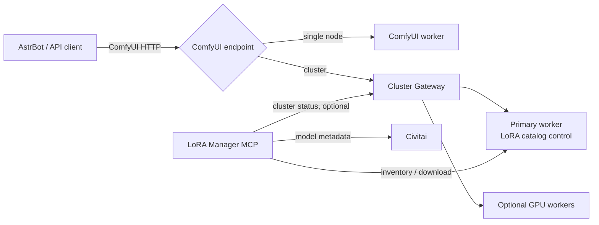

# ComfyUI Playground Documentation

This is the English entry point for the ComfyUI Playground image-generation
stack. The Chinese documentation is the default and authoritative operational
guide: [README.md](README.md).

[Chinese](README.md) | [Roadmap](ROADMAP.en.md) | [Gateway](https://github.com/comfy-playground/comfyui-cluster-gateway) | [MCP](https://github.com/comfy-playground/comfyui-lora-manager-mcp)

## Stack at a glance

The stack can begin with a single ComfyUI worker, add MCP for conversational
LoRA management, then introduce Gateway for persistent multi-worker scheduling
and optional batching. MCP remains a separately deployed service in every
topology.

| Document | Scope |
| --- | --- |
| [Architecture](docs/architecture.en.md) | Data/control paths and component boundaries |
| [Deployment examples](docs/deployments.en.md) | Single node, single node plus MCP, and clustered Gateway plus MCP |
| [Workflows and ecosystems](docs/workflows.en.md) | API workflow examples, LoRA and batching constraints |
| [AstrBot integration](docs/astrbot.en.md) | Plugin choices and endpoint configuration |
| [Operations](docs/operations.en.md) | Secrets, upgrades, backup and troubleshooting |
| [Roadmap](ROADMAP.en.md) | Current state and planned work |

Examples intentionally use placeholders. Never commit real API keys, LAN
addresses, model paths, GPU names, or generated media.
