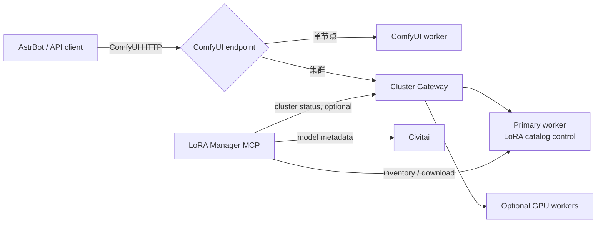

# ComfyUI Playground 文档

这是 ComfyUI Playground 整套图像生成平台的中文主文档。它说明如何把 ComfyUI
worker、Cluster Gateway、LoRA Manager MCP 和 AstrBot 组合为可从单卡逐步扩展到
多 GPU 的服务，而不要求一开始就部署全部组件。

[English](README.en.md) | [路线图](ROADMAP.md) | [Gateway](https://github.com/comfy-playground/comfyui-cluster-gateway) | [MCP](https://github.com/comfy-playground/comfyui-lora-manager-mcp)

## 组件地图

| 组件 | 职责 | 何时需要 |
| --- | --- | --- |
| ComfyUI worker | 执行工作流、持有模型、输出图片和 LoRA Manager | 始终需要 |
| Cluster Gateway | 多 worker 调度、持久化队列、输出归档、可选合批 | 多 GPU 或需要统一 API 时 |
| LoRA Manager MCP | LoRA 检索、下载、库存管理和集群只读状态 | 需要对话式 LoRA 管理时 |
| AstrBot 插件 | 聊天入口、工作流选择和参数注入 | 需要机器人交互时 |

## 从哪里开始

1. 只有一台 GPU：先阅读[单节点部署](docs/deployments.zh-CN.md#方案-a单节点)。
2. 单节点且需要 LoRA 检索/下载：增加 MCP，见[单节点加 MCP](docs/deployments.zh-CN.md#方案-b单节点--mcp)。
3. 多 GPU 或多台 worker：使用 Gateway 和 MCP，见[集群部署](docs/deployments.zh-CN.md#方案-c多-worker--gateway--mcp)。
4. 需要现有聊天机器人入口：按[AstrBot 选型](docs/astrbot.zh-CN.md)连接到单节点或 Gateway。

## 为什么采用这套组合

- **渐进扩展**：单节点 API 与 Gateway 对外的 ComfyUI 风格接口一致，客户端切换地址即可扩容。
- **故障边界清晰**：MCP 是独立仓库和独立 Compose 项目；Gateway 未部署或离线不影响单节点 MCP 的 LoRA 功能。
- **可恢复执行**：Gateway 持久化队列、worker prompt 映射和输出索引，worker 离线后已完成图片仍可读取。
- **一致的 LoRA 控制面**：primary worker 负责 catalog mutation，Gateway 在变更时同步其他 ready worker。
- **有条件的吞吐提升**：严格等价的请求可合批，同时保留每个客户端独立的 prompt ID、history 和输出。
- **工作流优先**：AstrBot 与 API 客户端都提交 ComfyUI API 工作流，不把模型或提示词约束写死在平台中。

## 文档索引

| 页面 | 内容 |
| --- | --- |
| [架构](docs/architecture.zh-CN.md) | 数据流、控制流、组件边界与兼容性约束 |
| [部署样例](docs/deployments.zh-CN.md) | 三种拓扑、环境变量、启动顺序与验收 |
| [工作流与生态](docs/workflows.zh-CN.md) | API workflow 样例、模型生态、LoRA 和合批约束 |
| [AstrBot 集成](docs/astrbot.zh-CN.md) | 插件选择、参数能力、工作流配置与接入地址 |
| [运维与安全](docs/operations.zh-CN.md) | token 边界、升级、备份、排障和发布规则 |
| [路线图](ROADMAP.md) | 已完成能力、近期工作和长期方向 |

所有示例使用占位路径、地址和 token 名称。生产配置必须保留在各组件仓库的本机
`.env`、`config.yaml` 和数据卷中，不应提交到 Git。
