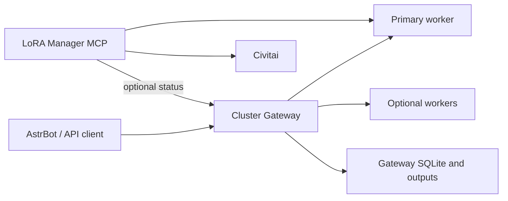

# Architecture

[Home](../README.en.md) | [中文](architecture.zh-CN.md)

The stack has four independent layers: clients, ComfyUI workers, optional
Cluster Gateway, and optional LoRA Manager MCP. A worker executes workflows.
Gateway owns multi-worker scheduling, durable job/output state, and the public
ComfyUI-compatible endpoint. MCP owns Civitai discovery plus LoRA Manager
orchestration and is never embedded in Gateway.

Every Gateway worker exposes exactly one visible GPU and must have compatible
models, custom nodes, and LoRA catalog content. Gateway validates the exact
device name from `/system_stats`. The primary worker is the only LoRA catalog
control plane; catalog mutations are drained and synchronized before success is
reported.

MCP always uses `COMFYUI_URL` for the primary worker. When
`COMFYUI_GATEWAY_URL` is absent, mutations go directly to that worker and the
cluster-status tool returns a successful `single-node` unavailable response.
When it is present, catalog synchronization and read-only cluster status use
Gateway. The MCP tool list is stable in both modes.

Batching is conservative. Only equivalent requests accepted by an adapter are
merged; logical prompt IDs, history, output ownership, and independent seeds
are retained. Supported families are SDXL Euler/normal, Anima Euler/sgm_uniform
and, with the custom stochastic sampler node, Anima er_sde. Missing worker
capabilities or a failed physical batch fall back to singleton execution.
