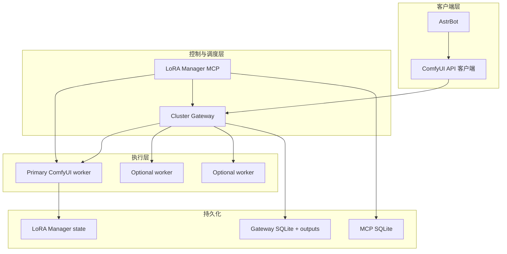

# 架构

[返回首页](../README.md) | [English](architecture.en.md)

## 分层与边界

### ComfyUI worker

worker 负责模型加载和工作流执行。每个被 Gateway 管理的 worker 必须只暴露一块
可见 GPU；Gateway 会校验 `/system_stats` 返回的精确设备名，避免配置错误时向错误
设备派发任务。准备接收同一工作流的 worker 必须拥有一致的模型、custom nodes 和
LoRA catalog。

### Cluster Gateway

Gateway 对外保留常用的 ComfyUI HTTP 形状，例如 `/prompt`、`/history/:id`、
`/view`、`/queue` 和 `/interrupt`。内部维护 SQLite 全局队列、幂等键、physical
execution 与逻辑 job 的映射，并将 worker 输出复制到自身数据目录。

primary worker 是唯一 LoRA catalog 控制面。对于 allowlist 内的 LoRA mutation，
Gateway 会暂停派发、执行 revision 同步和 worker full rebuild，随后恢复队列。

### LoRA Manager MCP

MCP 不在 Gateway 进程或镜像内。它使用 `COMFYUI_URL` 操作 primary worker 的
LoRA Manager API；只有设置 `COMFYUI_GATEWAY_URL` 时，catalog mutation 才经由
Gateway，同步启用 `get_generation_cluster_status` 的真实集群状态。

未配置 Gateway 时该工具仍存在，但返回 `mode: "single-node"` 与
`gateway_status_available: false`。这让单节点与集群使用同一套 MCP tool list。

## 关键数据流

| 流程 | 单节点 | Gateway 集群 |
| --- | --- | --- |
| 出图请求 | 客户端直接 `POST /prompt` 到 worker | 客户端 `POST /prompt` 到 Gateway，Gateway 选择 ready worker |
| history 与图片 | 由 worker 持有 | Gateway 持久化 history 索引并归档输出 |
| LoRA 下载 | MCP 或 UI 调 worker LoRA Manager | 下载留在 primary worker，catalog 同步经 Gateway |
| 集群状态 | 不适用 | MCP 从 `/gateway/v1/status` 只读获取 |

## 合批约束

合批只处理 adapter 判定为严格等价的排队请求。它不会把任意两个工作流拼在一起，且
每个逻辑请求仍保留独立 prompt ID、history 和图片归属。当前适配器覆盖：

- SDXL `euler/normal`；
- Anima `euler/sgm_uniform`；
- 安装 `GatewayMultiSeedStochasticSampler` 后的 Anima `er_sde`。

`er_sde` 为保证每个 member 的独立随机状态而逐 member 调 sampler；其正确性优先于
线性吞吐提升。worker 缺少所需节点或 batch 失败时，Gateway 自动回退到 singleton。
