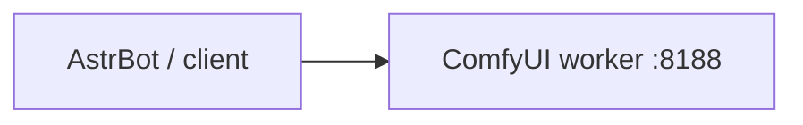
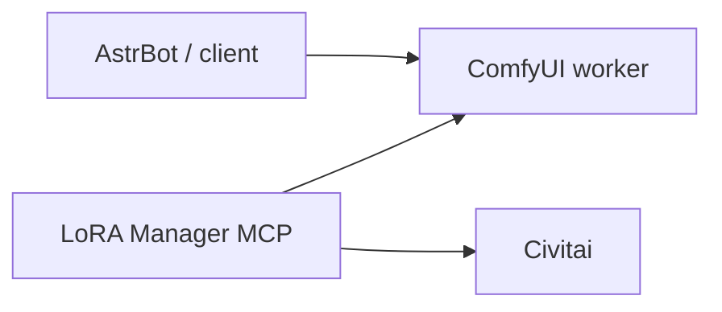
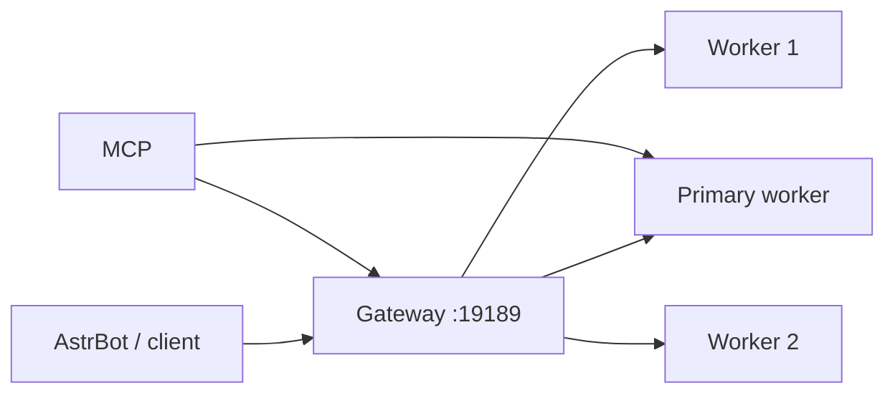

# 部署样例

[返回首页](../README.md) | [English](deployments.en.md)

本文用 `worker.example`、`gateway.example` 和占位目录说明结构。实际 Compose、
镜像和存储挂载由对应组件仓库拥有。

## 方案 A：单节点

适合第一台 GPU、开发环境或只需要 API 生图的场景。



1. 部署一个 ComfyUI worker，保证模型目录可写、工作流可直接在该 worker 成功执行。
2. 将 AstrBot 插件的 `server_address` 设为 `http://worker.example:8188`。
3. 使用 `/prompt`、`/history` 和 `/view` 验证 API workflow。

不需要 Gateway、MCP 或 worker batch node。若 worker 使用 LoRA Manager 下载需认证
的 Civitai 内容，token 必须留在 worker 的本机 `.env`。

## 方案 B：单节点 + MCP

适合需要通过 LLM/工具检索 Civitai、查看本地 LoRA、下载和逻辑启停 LoRA 的单 GPU
环境。



MCP 的最小配置如下。不要设置 `COMFYUI_GATEWAY_URL`：

```dotenv
COMFYUI_URL=http://worker.example:8188
COMFYUI_GATEWAY_URL=
LORA_ROOT=/app/ComfyUI/models/loras
CIVITAI_API_KEY=
```

启动 MCP 后，`get_generation_cluster_status` 返回单节点不可用状态，这是预期行为；
`search_loras`、库存查询和下载工具仍正常工作。MCP 的 Civitai token 认证其元数据
请求，不会替代 worker 用于受认证下载的 token。

## 方案 C：多 worker + Gateway + MCP

适合多 GPU、worker 可独立重启、需要统一队列/输出和可选合批的生产部署。



Gateway 配置必须有一个 `required: true` 且 `primary: true` 的 worker。示例见
[`examples/cluster/gateway.config.example.yaml`](../examples/cluster/gateway.config.example.yaml)：

```yaml
workers:
  - id: primary
    url: http://primary-worker.example:8188
    expected_device_name: "COPY_THE_EXACT_SYSTEM_STATS_DEVICE_NAME"
    required: true
    primary: true
    enabled: true
  - id: gpu-worker-1
    url: http://gpu-worker-1.example:8188
    expected_device_name: "COPY_THE_EXACT_SYSTEM_STATS_DEVICE_NAME"
    required: false
    primary: false
    enabled: true
```

MCP 同时指向 primary worker 和 Gateway：

```dotenv
COMFYUI_URL=http://primary-worker.example:8188
COMFYUI_GATEWAY_URL=http://gateway.example:19189
COMFYUI_GATEWAY_GENERATION_TOKEN=
LORA_ROOT=/app/ComfyUI/models/loras
```

AstrBot 插件的 `server_address` 指向 `http://gateway.example:19189`。先验证 required
worker 的 `/readyz`，再连接客户端；optional worker 离线不应阻断服务。

## 共同验收清单

- 每个工作流先在直接 worker 上单独成功执行。
- worker 只暴露一块 GPU，且 Gateway 配置中的设备名与 `/system_stats` 完全一致。
- 同一 workflow 会路由到的 worker 拥有相同模型、节点和 LoRA catalog。
- 设置 token 时，外部暴露地址位于反向代理、TLS 和访问控制之后。
- Gateway 运行后检查 `/healthz`、`/readyz`、`/gateway/v1/status`。
- MCP 运行后检查 `/healthz`，并在单节点/集群模式确认状态工具的语义正确。
